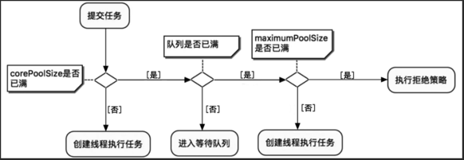

## 一、进程，线程操作系统基础 
## 二、Java 线程 
> Java 中线程管理与调度是委托给操作系统的调度进程去完成的，也就是常说的： java 线程就是操作系统线程， 部分操作系统上(Solaris)， JVM将每个Java线程一对一对应操作系统线程，完全委托 

### 2.1、线程核心概念 
#### 调度模型 
Java 中采用抢占式调度模型，优先级越高越有机会获取CPU控制权，但是并不决定，由抢占结果决定 
#### 优先级 
```java
// Thread 类的实例属性, 1-10之间 
private int priority;  
```
#### 生命周期 
```java
private int threadState; // 以整数形式存储状态 
public Thread.State getState(); // 返回一个枚举类型的状态值 
 
public enum State { 
    NEW, // 新建 
    RUNNABLE, // 可执行(就绪 + 执行) 
    BLOCKED, // 阻塞 
    WAITING, // 等待 
    TIMED_WAITING, // 超时等待 
    TERMINATED; // 终止 
} 
```
**生命周期状态(语言层面六种)**

1. **NEW**: 创建成功但是没有调用start()方法启动的Thread线程实例都处于NEW状态 
2. **RUNNABLE**： java 的运行态包含了 操作系统的就绪态+运行态， Java程序调用Thread.start()后，程序线程进入RUNNABLE状态，此时操作系统线程进入就绪态，等待CPU时间，得到CPU时间开始运行程序指令时，才真正进入运行态;
3. **BLOCKED**: 阻塞态
3. **TERMINATED**: 处于RUNNABLE状态的线程在run()方法执行完成之后就变成终止状态TERMINATED了 
4. **WAIT/TIMED_WAITING**: 线程进入等待态，一般是因资源竞争或者锁进入了一种条件等待状态， 进入该类状态的行为有：
    - Object.wait() 
    - Thread.join() 
    - LockSupport.park()
    - Thread.sleep(long millis) 
    - Object.wait(long timeout) 
    - Thread.join(long timeout) 
    - LockSupport .parkNanos(Object blocker, long nanos) 
    - LockSupport .parkUntil(Object blocker, long deadline)

### 2.2、线程创建方式 
```java
// 承Thread 类实现
class MyThread extends Thread{ 
    public void run(){ 
        // do something 
    } 
} 
//  实现 Runnable 接口 
class MyRunnable implements Runnable{ 
    public void run(){ 
        // do something 
    } 
    public static void main(String[] args){ 
        Thread t = new Thread(new MyRunnable()) 
    } 
} 
//  基于Callable 与 FutureTask 方式 
class MyStringCallable implement Callable<String>{ 
    public String call() throws Exception{ 
       // do something and return a `String` 
       return "hello world"; 
    } 
    public static void main(String[] args){ 
        FutureTask<String> futureTask = new FutureTask(new MyStringCallable()); 
        Thread t1 = new Thread(futureTask); 
        t1.start(); 
        try { 
            String s = futureTask.get(); // 阻塞, 提供超时参数的API 
        } catch (InterruptedException | ExecutionException e) { 
            e.printStackTrace(); 
        } 
        assert futureTask.isDone() == true; 
    } 
} 
```
### 2.3、开销与缺陷 

- 必须为线程堆栈分配和初始化大量内存块，其中包含至少1MB的栈内存 
- 需要进行内存调用，在OS中创建与注册本地线程 
- 并发情况下频繁的线程创建与销毁会导致性能受损 
## 三、Java线程池 
### 3.1、核心接口
#### Executor接口
任务执行者, 接口方法接受一个 Runnable 接口对象，进行任务的执行调度

#### ExecutorService接口
任务提交者，核心提供像线程池内提交任务功能, 同时也提供线程池管理的能力
- 支持向池内提交 Runnable 与 Callable 实例 
- 支持批量执行指定任务集合，并支持到超时 
- 支持管理线程池状态，`shutdown()` 管理线程池 

#### ThreadPoolExecutor类
Java 核心线程池的实现 

#### ScheduledExecutorService接口
在线程池管理的基础上提供以下能力 

- 按期循环执行 
- 延迟执行 
### 3.2、核心原理 
#### 线程池状态 
```java
private static final int RUNNING    = -1 << COUNT_BITS; 
private static final int SHUTDOWN   =  0 << COUNT_BITS; 
private static final int STOP       =  1 << COUNT_BITS; 
private static final int TIDYING    =  2 << COUNT_BITS; 
private static final int TERMINATED =  3 << COUNT_BITS; 
```
#### 线程池创建方式 
```java
public static void main(String[] args){
    ThreadPoolExecutor pool = new ThreadPoolExecutor( 
    int corePoolSize, // 最大线程数，一旦创建，即使线程空闲也不会回收 
    int maximumPoolSize, // 线程数的上线，超过corePoolSize的部分空闲时可能被回收 
    long keepAliveTime,// 线程最大的空闲时长，超过则可能被回收 
    TimeUnit unit, // 空闲时长的时间单位 
    BlockingQueue<Runnable> workQueue, // 待执行任务的排队队列 
    ThreadFactory threadFactory, // 新线程的创建工厂方法 
    RejectedExecutionHandler handler //超过接受能力的任务拒绝策略 
    ); 
    // example 
    final int corePoolSize = 10; 
    final int maximumPoolSize = 20; 
    final long keepAliveTime = 10L; 
    final TimeUnit keepAliveTimeUnit = TimeUnit.SECONDS; 
    BlockingQueue<Runnable> taskQueue = new ArrayBlockingQueue<>(10); 
    ThreadFactory threadFactory = Thread::new; 
    RejectedExecutionHandler handler = new ThreadPoolExecutor.AbortPolicy(); 
    pool = new ThreadPoolExecutor( 
        corePoolSize,  
        maximumPoolSize, 
        keepAliveTime,  
        keepAliveTimeUnit,  
        taskQueue,  
        threadFactory, 
        handler 
    ); 
}  
```
#### 核心线程数 (corePoolSize) 与 最大线程数 (maximumPoolSize) 
> 核心线程数(corePoolSize) 可以认为是线程池常规维持的线程数量, 最大线程数(maximumPoolSize) 可以认为是线程池中可以创建的最大的线程数量; 遵循以下规则 

1. 当在线程池接收到新任务，并且当前工作线程数少于 corePoolSize 时，即使其他工作线程处于空闲状态，也会创建一个新线程来处理该请求，直到线程数达到 corePoolSize; 即线程池会仅最大可能的创建达到core 
2. 部分场景下会出现线程池创建超过 corePoolSize数量的线程数, 仅当满足以下条件时, 线程池才会创建超出corePoolSize限制的线程数量 
- maximumPoolSize > corePoolSize 
- 当前工作线程数量 >= corePoolSize 
- 当前工作线程数量 < maximumPoolSize 
- 当前任务排队队列(BlockingQueue)已满 
#### 线程最大空闲时间 (keepAliveTime ) 
线程池内线程最大的空闲时间, 如果线程空闲超过这个时间: 

- 默认情况下,非 core的线程会被回收 
- 当设定了ThreadPoolExecutor.allowCoreThreadTimeOut(true)时, 则空闲回收也适用于core线程 
#### 任务队列 (BlockingQueue<Runnable>) 
任务等待队列用于接受当核心线程无法及时处理的任务, 用作任务临时缓冲; 
Java中的阻塞队列（BlockingQueue）与普通队列相比有一个重要的特点：**在阻塞队列为空时会阻塞当前线程的元素获取操作**。在一个线程从一个空的阻塞队列中获取元素时线程会被阻塞，直到阻塞队列中有了元素；当队列中有元素后，被阻塞的线程会自动被唤醒（唤醒过程不需要用户程序干预) 

**以ArrayBlockingQueue 的实现为例**
```java
public E take() throws InterruptedException { 
    final ReentrantLock lock = this.lock; 
    lock.lockInterruptibly(); 
    try { 
        while (count == 0) 
            notEmpty.await(); // 当元素为空时,会在条件变量上进行阻塞等待 
        return dequeue(); 
    } finally { 
        lock.unlock(); 
    } 
} 
```
- **ArrayBlockingQueue:** 数组实现的有界队列(创建必须指定大小) 
- **LinkedBlockingQueue:** 链表实现的队列,默认无界, 可以设置容量大小, 吞吐量通常高于 ArrayBlockingQueue 
- **PriorityBlockingQueue:** 基于数值实现, 具有优先级的无界队列 
- **DelayQueue:** 无界阻塞延迟队列，底层基于PriorityBlockingQueue实现，队列中每个元素都有过期时间，当从队列获取元素（元素出队）时，只有已经过期的元素才会出队，队列头部的元素是过期最快的元素 
- **SynchronousQueue:** 同步队列,不存储元素的队列, 每个插入操作必须等到另一个线程的调用移除操作，否则插入操作一直处于阻塞状态，其吞吐量通常高于LinkedBlockingQueue 
#### 拒绝策略 (RejectedExecutionHandler) 
任务拒绝的场景, 共两种情况:
1. 线程池已经被关闭。 
2. 任务队列已满且线程数量达到了 maximumPoolSize; 

**JUC**提供了默认的几种拒绝策略实现
- **AbortPolicy**：拒绝策略 (默认选用), 如果线程池队列满了，新任务就会被拒绝，并且抛出RejectedExecutionException异常 
- **DiscardPolicy**：抛弃策略, 如果线程池队列满了，新任务就会直接被丢掉，并且不会有任何异常抛出 
- **DiscardOldestPolicy**：抛弃最老任务策略, 如果队列满了，就会将最早进入队列的任务抛弃，从队列中腾出空间，再尝试加入队列。因为队列是队尾进队头出，队头元素是最老的，所以每次都是**移除队头元素**后再尝试入队 
- **CallerRunsPolicy**：调用者执行策略(**提交者执行任务**), 在新任务被添加到线程池时，如果添加失败，那么提交任务线程会自己去执行该任务，不会使用线程池中的线程去执行新任务 
- 也可以**手动实现自定义**的 Policy 
#### 线程池任务调度流程 
线程池的任务执行与调度流程核心实现在 **ThreadPoolExecutor.execute()** 方法, 基于以下逻辑进行调度调度升级


### 3.3 、线程池数量设计 
|  |  IO 密集型 |  CPU密集型 |  IO/CPU 混合型 |
| ------ | --- | --- | --- |
| 类型特点  | 任务主要执行的是IO操作,由于IO操作时间长,导致**CPU的利用率低, CPU常处于空闲状态** | 任务主要执行的是CPU操作, **CPU一直处于运行状态,利用率高** | 任务既要执行逻辑计算,又要执行IO操作(数据库访问,RPC调用), 相对来说,一般IO耗时占比高于CPU操作耗时占比, **CPU利用率相对也不高** |
| 应用举例  |  网络框架如Netty的IO通信  | 逻辑计算, 内存数据操作等  | HTTP网络服务  |
| 线程数设计公式  | CPU核心数 * 2  | CPU核心数 * 1  | ((线程等待时间 / 线程CPU时间) / 线程CPU时间) * CPU核心数线程IO等待时间越长，需要设计的线程数越多， 但是也不是越多越好，适当的线程数才合适  |

